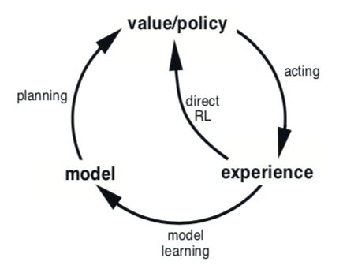
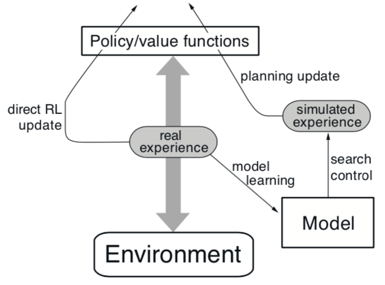
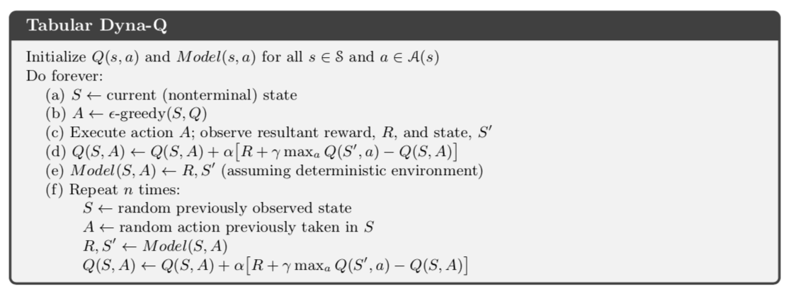
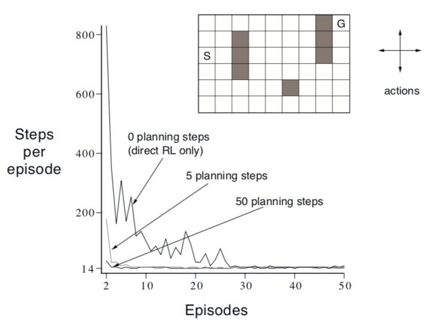
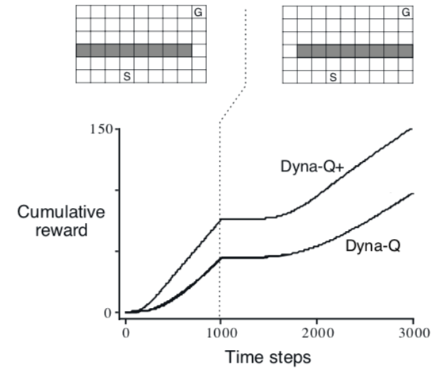
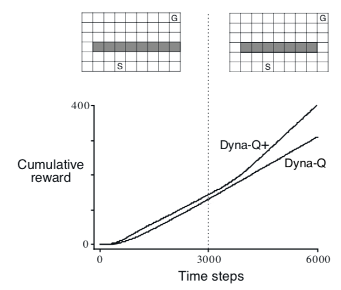

# 第八章：Planning and Learning with Tabular Methods

彭正皓

[TOC]

## 前言

本章将纵论需要一个模型的方法（Model-based），如动态规划和启发式搜索，以及不需要模型的方法（Model-free）如蒙特卡洛法和TD法。

Model-based需要planning，Model-free需要learning。

Model-based和Model-free的相同点：

* 需要计算价值函数
* 所有方法都需要展望未来的事情，并折现，以此来计算价值函数的估计值。

## 8.1 Models and Planning

* 定义：Model指的是agent可以用来预测**环境如何回应他的动作**的任何东西。

* 给定一个(state, action)返回一个(next state, next reward)

* Distribution Models：
  * 返回所有可能的state以及对应的概率。
  * 给定初始状态和动作，分布模型可以给出所有可能的transitions。
* Sample Models：
  * 依概率仅采样一个。
  * 给定初始状态和动作，采样模型可以给出一个可能的transitions。
* 模型用来生成模拟的experience。

* 定义：Planning指的是以模型为输入，以policy为输出的一个计算过程。
* State-space Planning：
  * 在state空间中搜索一个最优policy或最优路径
  * 价值函数是基于state来计算的
* Plan-space Planning：
  * 在plan空间搜索
  * Operators将一个plan转换成另一个plan
  * 价值函数是基于plan来计算的
  * 这种方法很难用于随机序列决策问题，因此不探讨。

* State-space Planning的**共同结构**：
  1. 需要计算价值函数，以作为改善policy的中间步骤
  2. 通过玩弄模拟experience来计算价值函数

* 不同的方法只有三种不同：
  1. 更新的类型
  2. 更新的顺序
  3. backup模拟经验（就是向后采样、展开模拟经验）多少次

* Planning最好是小步、增量的，这样一边planning、一边执行、一边学习模型的不会太乱。

## 8.2 Dyna: Integrated Planning, Acting, and Learning

当Planing是Online的，同时要与环境交互的时候，会产生一些有趣的问题。

* 新收集的信息会改变模型，从而影响Planning
* 如何将Planning适配于目前的State
* Planing和模型学习运算量可能都很大，要把计算资源分成两部分。

图注：简单联系了经验、模型、价值函数、策略的关系。

* Dyna-Q：一个简单的框架，包含了**Online Planning Agent**需要的基本功能：

  (1) planning, (2) acting, (3) model-learning, (4) direct RL

* 真实经验的两个用处：
  1. 用来更新模型（Model-learning，Indirect RL）
  2. 用来更新价值函数和策略（Direct RL）

|      | Direct RL                              | Indirect RL                |
| ---- | -------------------------------------- | -------------------------- |
| 优点 | 很简单。不受模型结构带来的bias的影响。 | 更高效利用样本。           |
| 缺点 | -                                      | -                          |
| 争论 | trial&error。更像动物。反应式决策。    | 意识的能动性。谨慎的规划。 |

* 作者认为，争论没有意义。寻两者之间的相似之处更有裨益。

### Dyna-Q算法

各个模块的具体方法：

* **Planning**: random-sample one-step tabular Q-planning method
* **Direct RL**: one-step tabular Q-learning
* **Model-learning**: table-based，用一个查找表记录$(s_t, a_t)\to (s_{t+1}, r_{t+1})$。不会查表未曾记录的值。

看图说话：

* 模型从真实经验中学习，产出仿真经验。
* search control：选择初始状态和动作以产出仿真经验的过程。

* 在Dyna-Q中，同一个强化学习方法用在了Learning（以真实经验为输入）和Planning（以仿真经验为输入上）。

如果(e)、(f)两步被省略了，那么这就是One-step Q Learning了。

你会发现Q函数其实被更新了n+1次。(d)就是direct RL。(e): Model-learning。(f): Q-Planning。

### Example 8.1: Dyna Maze

这是一个迷宫问题。当Planning的step数目（n）越大的时候，Dyna-Q算法收敛得越快。可以看到，相比起n=0，即one-step的Q-learning算法而言，使用了50步Planning的算法（50次调用Model以从仿真经验中更新Q函数）收敛速度极快。

## 8.3 When the Model Is Wrong

模型有错的几个原因：

* 环境是随机的，采样的内容可能不够多
* 模型是近似函数，可能缺乏泛化性
* 环境发生了变化，环境的新行为没有被观察过

一旦模型发生错误，在一些情况下会很快地纠正过来：

* 模型是乐观的。它给出更高的reward或者更好的state transition
* 这样，agent就会尽力去exploit这种更好的结果
* 结果就会更快的发现它们并不存在 

### Exploit和Explore问题

* Explore：尝试Action来提升模型
* Exploit：根据目前的模型，以最优的方式行动

这两者的平衡是一个大问题。

作者提出了Dyna-Q+算法来研究：

* 给定一个state，为此state下的每个action记录一个“上次出现到现在过了多少时间”的值$\tau$
* 修改reward函数：$r_{new}=r_{old}+k\sqrt{\tau}$，其中k是小量
* 这其实类似于“curiosity”，可以鼓励agent去探索很久没去的那些action
* 与Dyna-Q相比还有两个不同：
  * 允许访问模型中没有记录过的(s, a)
  * $Model(s_t, a_t) = (s_{t+1}=s_{t}, r_{t+1}=0)$

### Example 8.2: Blocking Maze

前1000step开通近路。然后封闭近路，只开通小路。

使用了非强化版本的Dyna-Q算法缺乏应变能力。

### Example 8.3: Shortcut Maze

前3000step开通远路。之后在保持远路开通的情况下开通近路。

没有修改reward的Dyna-Q算法，根本就不会尝试近路。因为在他的模型中，这个地方一直是封闭的，不存在近路。

换言之，Dyna-Q算法此时一直在Exploit它的最优解，而没有Explore的过程。

