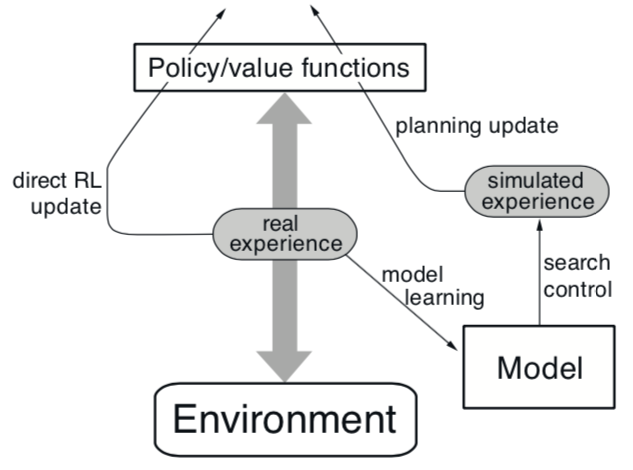
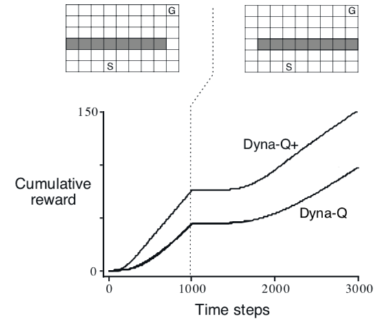

# 第八章：规划与学习（表格法）

:fountain_pen: ​彭正皓

[TOC]

## 前言

本章将纵论需要一个模型的方法（Model-based），如动态规划和启发式搜索，以及不需要模型的方法（Model-free）如蒙特卡洛法和TD法。

Model-based需要planning，Model-free需要learning。

Model-based和Model-free的相同点：

* 需要计算价值函数
* 所有方法都需要展望未来的事情，并折现，以此来计算价值函数的估计值。

## 8.1 Models and Planning

* 定义：Model指的是agent可以用来预测**环境如何回应他的动作**的任何东西。

* 给定一个(state, action)返回一个(next state, next reward)

* Distribution Models：
  * 返回所有可能的state以及对应的概率。
  * 给定初始状态和动作，分布模型可以给出所有可能的transitions。
* Sample Models：
  * 依概率仅采样一个。
  * 给定初始状态和动作，采样模型可以给出一个可能的transitions。
* 模型用来生成模拟的experience。

* 定义：Planning指的是以模型为输入，以policy为输出的一个计算过程。
* State-space Planning：
  * 在state空间中搜索一个最优policy或最优路径
  * 价值函数是基于state来计算的
* Plan-space Planning：
  * 在plan空间搜索
  * Operators将一个plan转换成另一个plan
  * 价值函数是基于plan来计算的
  * 这种方法很难用于随机序列决策问题，因此不探讨。

* State-space Planning的**共同结构**：
  1. 需要计算价值函数，以作为改善policy的中间步骤
  2. 通过玩弄模拟experience来计算价值函数

* 不同的方法只有三种不同：
  1. 更新的类型（Expected Updates / Sample Updates，即取所有transition出来计算E max Q，还是依概率取一个样本出来更新）
  2. 更新的顺序
  3. backup模拟经验（就是向后采样、展开模拟经验）多少次

* Planning最好是小步、增量的，这样一边planning、一边执行、一边学习模型的不会太乱。

## 8.2 Dyna: Integrated Planning, Acting, and Learning

当Planing是Online的，同时要与环境交互的时候，会产生一些有趣的问题。

* 新收集的信息会改变模型，从而影响Planning
* 如何将Planning适配于目前的State
* Planing和模型学习运算量可能都很大，要把计算资源分成两部分。

图注：简单联系了经验、模型、价值函数、策略的关系。

* Dyna-Q：一个简单的框架，包含了**Online Planning Agent**需要的基本功能：

  (1) planning, (2) acting, (3) model-learning, (4) direct RL

* 真实经验的两个用处：
  1. 用来更新模型（Model-learning，Indirect RL）
  2. 用来更新价值函数和策略（Direct RL）

|      | Direct RL                              | Indirect RL                |
| ---- | -------------------------------------- | -------------------------- |
| 优点 | 很简单。不受模型结构带来的bias的影响。 | 更高效利用样本。           |
| 缺点 | -                                      | -                          |
| 争论 | trial&error。更像动物。反应式决策。    | 意识的能动性。谨慎的规划。 |

* 作者认为，争论没有意义。寻两者之间的相似之处更有裨益。

### Dyna-Q算法

各个模块的具体方法：

* **Planning**: random-sample one-step tabular Q-planning method
* **Direct RL**: one-step tabular Q-learning
* **Model-learning**: table-based，用一个查找表记录$(s_t, a_t)\to (s_{t+1}, r_{t+1})$。不会查表未曾记录的值。

看图说话：

* 模型从真实经验中学习，产出仿真经验。
* search control：选择初始状态和动作以产出仿真经验的过程。

* 在Dyna-Q中，同一个强化学习方法用在了Learning（以真实经验为输入）和Planning（以仿真经验为输入上）。

如果(e)、(f)两步被省略了，那么这就是One-step Q Learning了。

你会发现Q函数其实被更新了n+1次。(d)就是direct RL。(e): Model-learning。(f): Q-Planning。

### Example 8.1: Dyna Maze

这是一个迷宫问题。当Planning的step数目（n）越大的时候，Dyna-Q算法收敛得越快。可以看到，相比起n=0，即one-step的Q-learning算法而言，使用了50步Planning的算法（50次调用Model以从仿真经验中更新Q函数）收敛速度极快。

## 8.3 When the Model Is Wrong

模型有错的几个原因：

* 环境是随机的，采样的内容可能不够多
* 模型是近似函数，可能缺乏泛化性
* 环境发生了变化，环境的新行为没有被观察过

一旦模型发生错误，在一些情况下会很快地纠正过来：

* 模型是乐观的。它给出更高的reward或者更好的state transition
* 这样，agent就会尽力去exploit这种更好的结果
* 结果就会更快的发现它们并不存在 

### Exploit和Explore问题

* Explore：尝试Action来提升模型
* Exploit：根据目前的模型，以最优的方式行动

这两者的平衡是一个大问题。

作者提出了Dyna-Q+算法来研究：

* 给定一个state，为此state下的每个action记录一个“上次出现到现在过了多少时间”的值$\tau$
* 修改reward函数：$r_{new}=r_{old}+k\sqrt{\tau}$，其中k是小量
* 这其实类似于“curiosity”，可以鼓励agent去探索很久没去的那些action
* 与Dyna-Q相比还有两个不同：
  * 允许访问模型中没有记录过的(s, a)
  * $Model(s_t, a_t) = (s_{t+1}=s_{t}, r_{t+1}=0)$

### Example 8.2: Blocking Maze

前1000step开通近路。然后封闭近路，只开通小路。

使用了非强化版本的Dyna-Q算法缺乏应变能力。

### Example 8.3: Shortcut Maze

前3000step开通远路。之后在保持远路开通的情况下开通近路。

没有修改reward的Dyna-Q算法，根本就不会尝试近路。因为在他的模型中，这个地方一直是封闭的，不存在近路。

换言之，Dyna-Q算法此时一直在Exploit它的最优解，而没有Explore的过程。

## 8.4 Prioritized Sweeping

（优先地扫）

### Model采样步骤的问题

* 从Model中采样的过程，即算法中的f步，是从所有曾经经历过的state、action对中均匀的取一个出来。
* Dyna-Q+对于未被经历过的state的处理是设其reward为零。
* 因此从Model中仿真的步骤，如果以均匀分布来取样state、action的话，会有大量的取样得到reward为零的情况，这对于update毫无帮助。
* **结论**：从goal state反向（backward）搜索会很好。

### Backward Focusing of Planning Computations

* Goal State是个“简便说法”。实际上任何在模型更新过程中value发生变化的state都可以认为是goal state，需要从它开始反向传播这个value的变化。

* 假设agent突然发现某个state的value变了，那么那些从别的state经过某种action到达这个state的value也要变化。因此这就有一个Backward Propagation。

### Prioritized Sweeping

* 在反向传播这个Value的变化的过程中，有两个“幅度”：一个是Value变化的幅度，一个是Transition的概率的变化的幅度。
* 这两个东西预示着某个State的value的变化是“更加紧急”的。
* 很自然去**优先更新**“更紧急”的state的value。
* 为此维护一个优先级队列：每个(state, action)对有一个优先级，其值为$|R+\gamma\max_a Q(S', a) - Q(S, A)|$，此值为Q函数的“误差”。（这个值有个阈值，太小了就不把这个state放进去）
* 队首的更新之后，计算这个state的所有“前人”的值，并更新这个优先队列。
* 实验证明加入了优先队列之后的算法的收敛速度为原来的5-10倍。

### Example 8.5 Prioritized Sweeping for Rod Maneuvering

棍子从起点出发，目标是到终点。棍子可以平移和旋转。只有4个离散的动作。有14400个可能的状态（实际更少，因为有障碍物）。使用非Prioritized的算法很难解出来。

### 扩展到随机的环境中

* 模型本来不是$(s_t, a_t)\to (s_{t+1}, r_t)$嘛，现在不是一对一的关系了，而是一对多的关系，即：$(s_t, a_t)\to \{(s_{t+1}, r_t, num)\}$，为每一个可能的下一对(s‘, r)，维护一个“出现次数”。
* 更新的时候改为数学期望$E_{S'}[ max_a Q(S', a)]$，而不仅仅是$max_a Q(S', a)$即可。

* Prioritized Sweeping的一个问题是需要耗费很多计算量在低概率的Transition上。（称之为Expected Updates）
* Sample Updates就是依概率取一个Transition出来，然后直接计算其max Q即可。

### 总结

* 本节介绍了Expected Updates和Sample Updates两个更新方式

* 引入了Backward Focusing的概念（即从goal倒推要更新哪些pairs）
* 还有一种Forward Focusing的做法。即优先更新那些高频state跳转过去的state。

## 8.5 Expected Updates与Sample Updates

### 不同One-Step算法比较

* 不同的One-step更新算法，有三个不同的维度：
  1. 更新State Value还是更新Action Value
  2. 估计的是最优策略的value还是任意给定策略的value
  3. Expected Updates还是Sample Updates
* 前面两个维度可以总结得到四个符号，即：$q_*, v_*, q_\pi, v_\pi$
* 这三个维度总结起来可得8种Updates算法。其中七种有用，如下图：

### Expected / Sample Updates概述

* Expected Updates：
  * 考虑了所有可能发生的transition
  * 必须要有一个transition的分布模型
  * 肯定得到一个更好的估计，因为没有采样误差
  * 但需要更多的计算资源
* Sample Updates：
  * 只考虑一个可能发生的样本。
  * 可以在缺乏分布模型的情况下，通过向环境或向sample模型采样的（回忆一下，有分布模型和采样模型两种Model）方式采样。
* 只有在环境是随机的情况下，二者才有显著的不同。
* 为了比较二者在Planning任务中的性能，计算资源必须相等。

### Expected / Sample Updates比较

* Expected Updates:
  * $Q(s, a)\gets \sum_{s',r} \hat{p}(s',r|s,a)[r+\gamma \max_{a'} Q(s', a')]$，其中$\hat{p}$是估计出来的概率分布。
  * 它的计算是“精确的”，会计算得到一个新Q。
  * 其准确性仅与下一个state的Q，即$Q(s', a')$有关。（为何不说那个估计的概率分布也有关呢？因为在我们的场景中它仅仅是transition出现的频率而已，可以认为是精确的）
* Sample Updates:
  * $Q(s, a)\gets Q(s, a)+\alpha [R+\gamma \max_{a'} Q(S', a')-Q(s,a)]$，其中S'从采样模型中得到。
  * 其精确性受到采样误差的影响。
  * 但是其计算量比Expected更新小得多。
* 如果让Expected Updates彻底计算完毕，并用同样的计算量计算Sample Updates的话，前者的表现会比后者好，因为没有采样误差。
* 然而实际情况是由于Sample Updates：
  1. 总是往好的方向进步，在Expected Updates还没有完成一轮的计算量下，其误差很快就将下去了。
  2. 由于其一步一步变好，未来的Updates只会比原来更好，更准确，这样就有一个滚雪球的效应。
* **结论**：在随机性强、状态空间大的任务中，使用Sample Updates更好。

